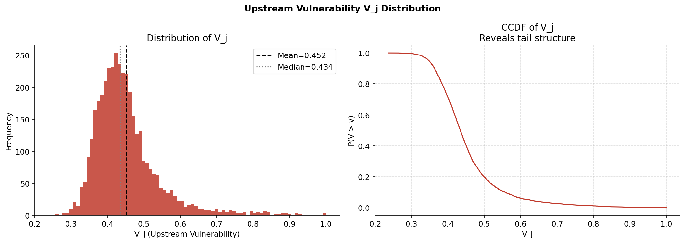
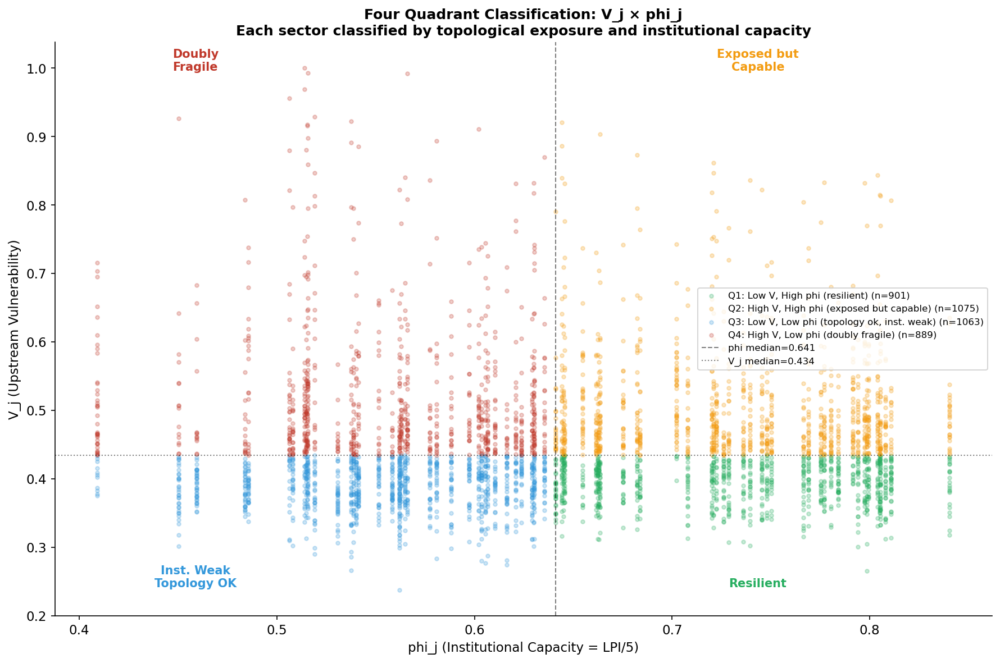
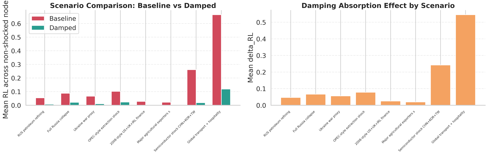
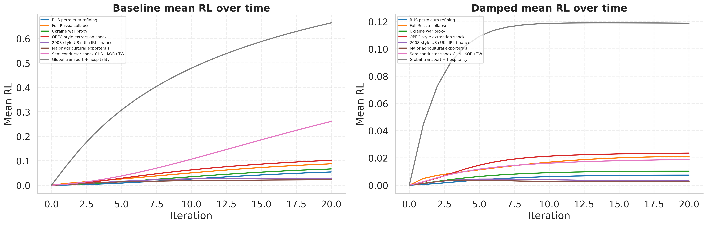
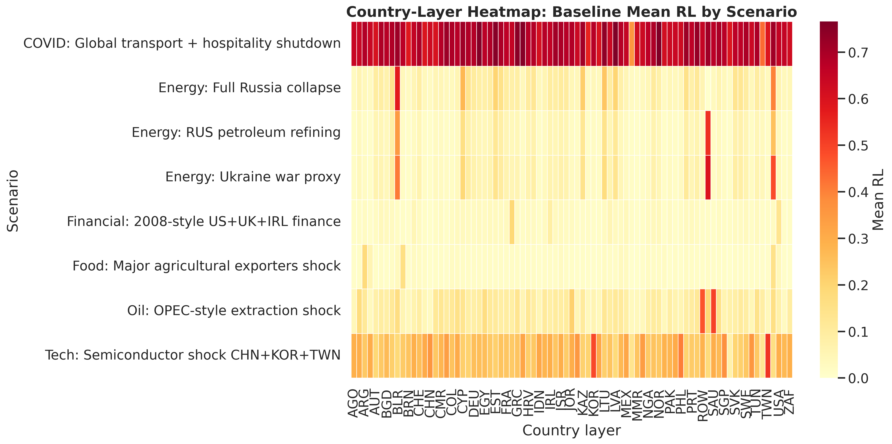
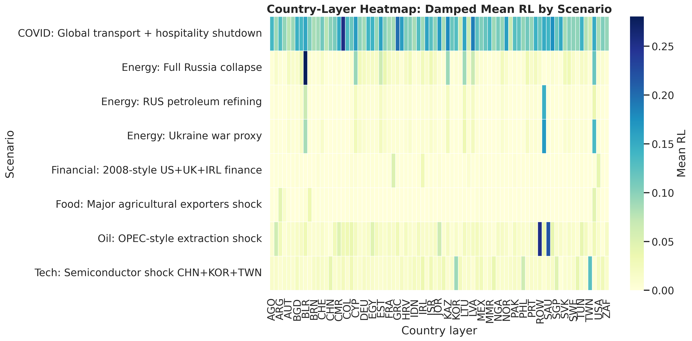
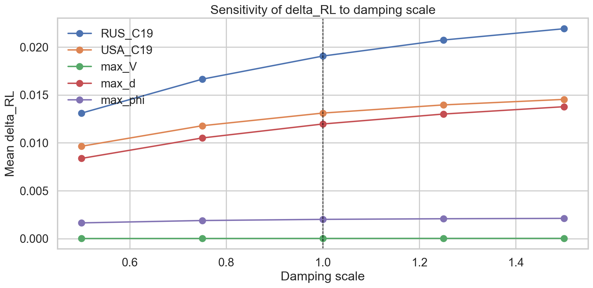
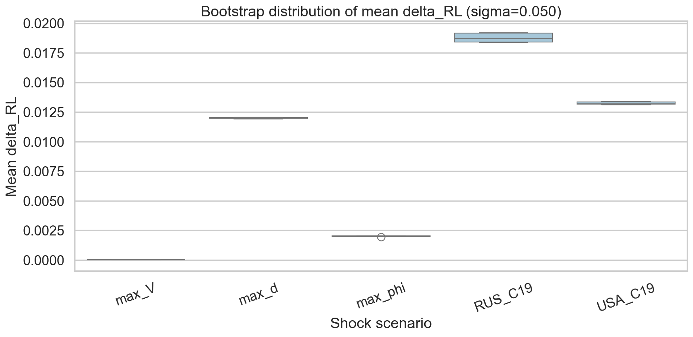

<!-- _class: lead -->
# Shock Propagation in the WION
## Baseline vs shock-only damping

Aditya
Thesis presentation
Apr 28, 2026

---

# Research question and pipeline

**Research question**
- How do network structure and institutional capacity shape shock propagation in the global input-output network?

**Pipeline (what I built)**
- WION 2018 data -> build network matrices (Z, A, X)
- EDA on structure and hubs
- Construct V_j (upstream vulnerability) and phi_j (institutional capacity)
- Baseline and damped simulations for 8 shock scenarios
- Multilayer country results + spillovers
- Robustness: scale sweep + bootstrap

---

# Data and network structure

| Key facts | Evidence |
| --- | --- |
| WION 2018 with ~3928 country-sector nodes |  |
| Sparse and hub-dominated supply structure | Out-degree fat tail; shocks from hubs matter most |
| Materiality threshold used for fragility | Links below 1 percent treated as weak for shock propagation |

---

# Methodology (baseline vs damped)

**Baseline dynamics**

$$
\mathbf{x}_{t+1} = A\,\mathbf{x}_t
$$

**Relative loss**

$$
RL_j(t) = \frac{x_j^{base}(t) - x_j^{shock}(t)}{x_j^{base}(t)}
$$

**Shock-only damping**

$$
\mathbf{x}_{t+1} = \mathbf{x}^{base}_{t+1} - A(I - D)\,\ell_t,
\quad \ell_t = \mathbf{x}^{base}_t - \mathbf{x}_t
$$

**Damping inputs**
- $V_j = \sum_i w_{ij} \cdot IRR_i$ (upstream vulnerability)
- $\phi_j = LPI_{c(j)} / 5$ (institutional capacity)
- $d_j = (1 - V_j) \cdot \phi_j$, and $D = \mathrm{diag}(d_j)$

| Quadrants (V_j vs phi_j) | |
| --- | --- |
| Exposed vs resilient sectors |  |

---

# Shock portfolio (8 scenarios)

- Energy: RUS petroleum node
- Energy: full Russia collapse
- Energy: Ukraine war proxy
- Oil: OPEC-style extraction shock
- Financial: 2008-style US + UK + IRL
- Food: major agricultural exporters
- Tech: semiconductors (CHN + KOR + TWN)
- COVID: transport + hospitality shutdown

All scenarios run baseline and damped for 20 iterations.

---

# Results overview

**Key takeaways**
- Damping reduces mean RL in every scenario.
- Examples (mean RL):
	- COVID: 0.664 -> 0.119 (absorption 0.545)
	- Tech: 0.261 -> 0.019 (absorption 0.242)
	- Full Russia: 0.088 -> 0.021 (absorption 0.066)
- Cumulative absolute loss reduction ranges ~37 to 62 percent.

---

# Dynamics over time

**Interpretation**
- Damping reduces the level and persistence of losses.
- Effects are strongest for large, system-wide shocks.

---

# Multilayer results (country layers)

| Baseline mean RL by scenario | Damped mean RL by scenario |
| --- | --- |
|  |  |

**Layer insight**
- Damping lowers mean RL across most country layers, not just a few hubs.

---

# Robustness and sensitivity

| Scale sweep | Bootstrap stability |
| --- | --- |
|  |  |

**Stability checks**
- Scale sweep: stronger damping -> larger mean delta_RL.
- Bootstrap (n=5):
	- RUS_C19 mean delta_RL = 0.01877, std = 0.00039
	- USA_C19 mean delta_RL = 0.01324, std = 0.00012

---

# Conclusions, limits, next steps

**Conclusions**
- Global production is hub-driven; shocks to hubs propagate widely.
- Shock-only damping materially reduces losses across all scenarios.
- Institutional capacity and structure both matter for absorption.

**Limitations**
- Linear IO model with fixed coefficients
- Damping is proxy-based (V_j and LPI), not firm-level behavior

**Next steps**
- Nonlinear constraints and substitution dynamics
- Time-varying coefficients, multi-year calibration
- Validate with firm or trade microdata

---

<!-- _class: lead -->
# Thank you

Questions?
